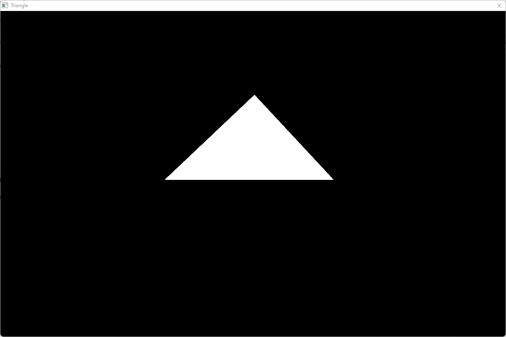

#### 3D from Scratch - Triangle (in progress)
Win32 is used to display a bitmap and all the maths is done by me (no OpenGL or DirectX). So far it is pretty basic but more will come.

  

#### ColorPicker

  

#### Herunterfahren

  

#### Snake

  

